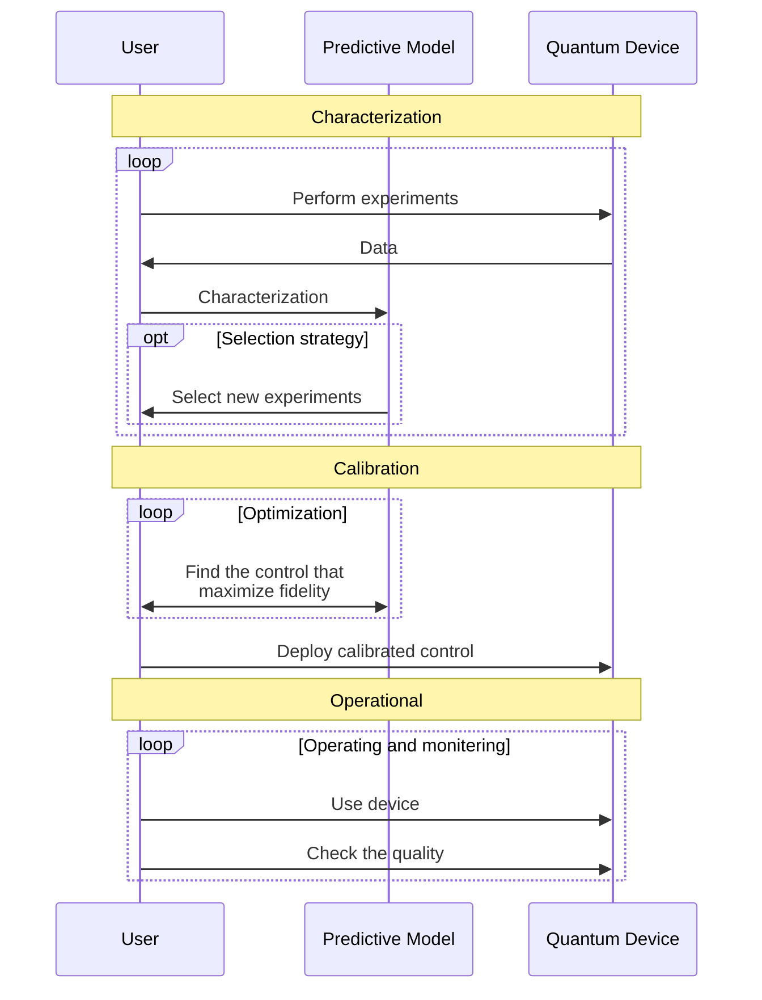
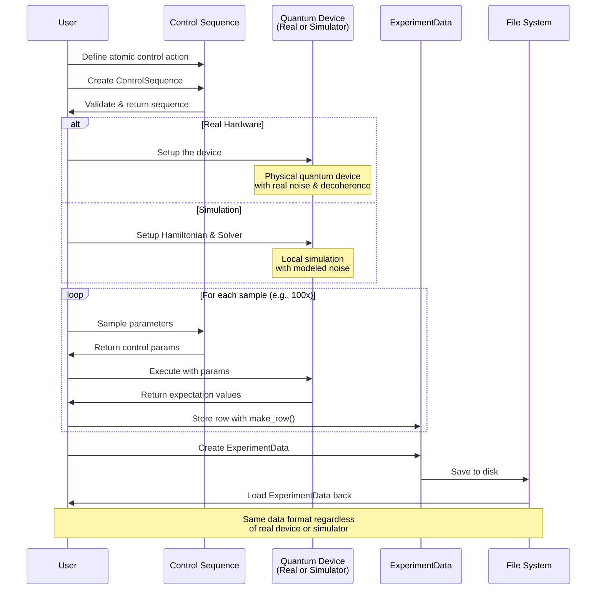
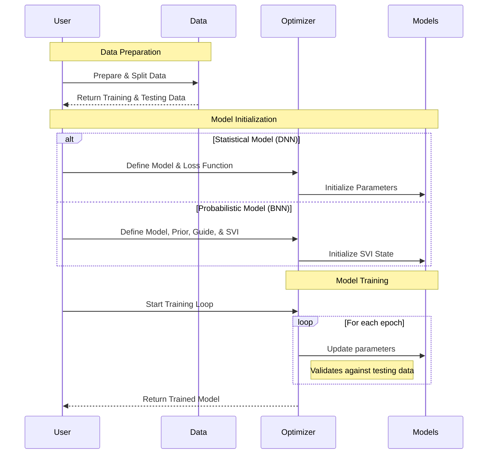
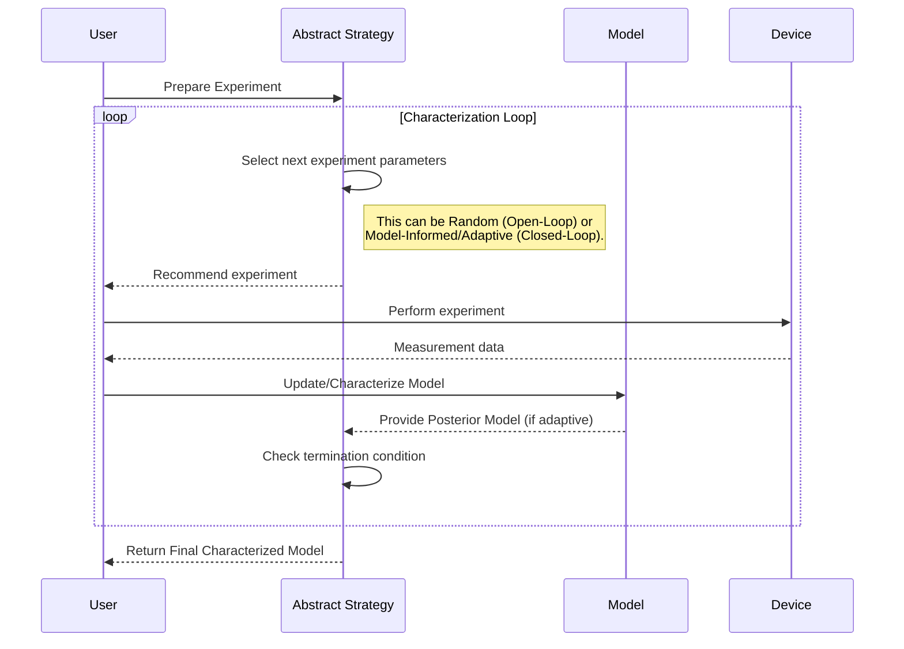
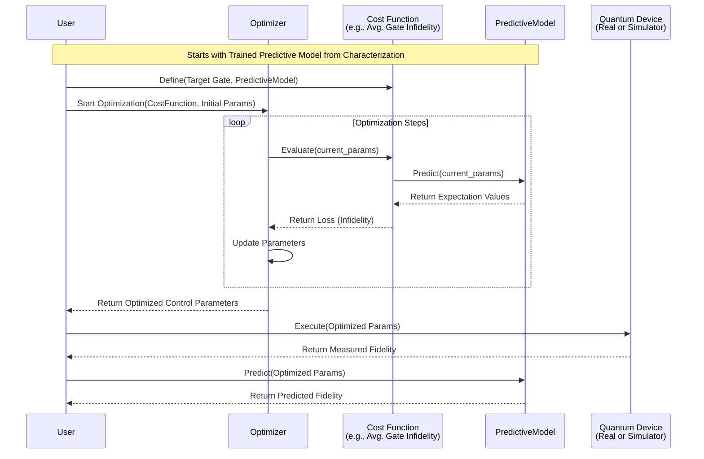

# Overviews

!!! goal
    Hi! This page is intended for user to understand the overall concept of `inspeqtor` in the high-level first. You might find this page useful when you reviews the interaction between modules and functions offered by `inspeqtor`.

We catergorized characterization and calibration of the quantum device into multiple phase. You might not necessary needs to do or understand every phases and chose to work with specific phases.

- [Experimental Phase](#experimental-phase) is a preparation of the characterization of the quantum device. It might dictate the constraint of your control calibration too.
- [Characterization Phase](#characterization-phase)
- [Control Calibration Phase](#control-calibration-phase)

!!! note
    We would like to remind user that `inspeqtor` is a framework. We provide some opinions of how to do things in the characterization and calibration task. Thus, `inspeqtor` provides user with a varities of utility functions which is designed to be easily replaced by custom function from the user. You don't have to use everything, just what you need 😉

## Experimental Phase

Diagram below shows the sequence of interaction between, the user, `inspeqtor`, quantum device, and file system. Please refer to tutorial of how to work with data and experiment using `inspeqtor` in this [tutorial](./../tutorial_0001_dataset).

## Characterization Phase

## Alternative Characterization phase

## Control Calibration Phase

## Physics
